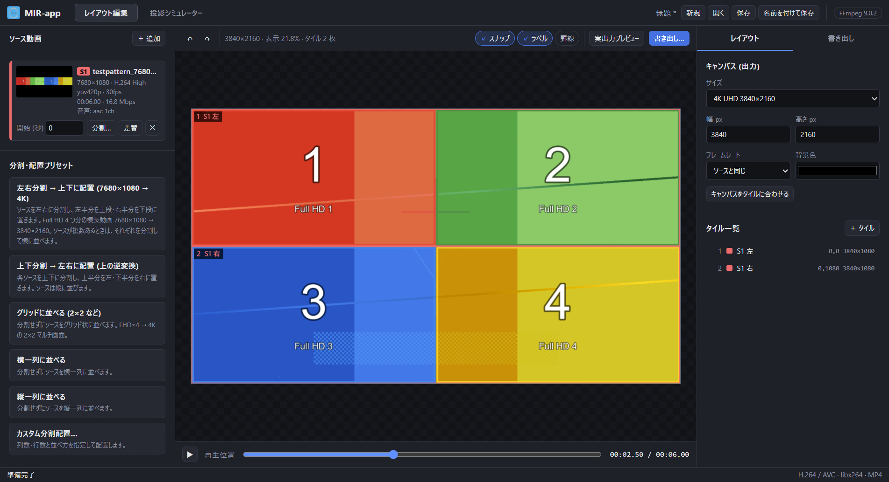
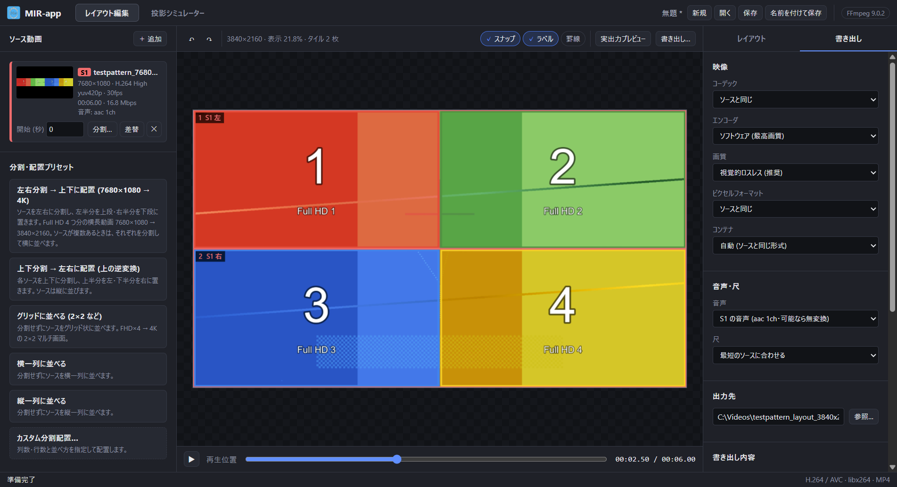
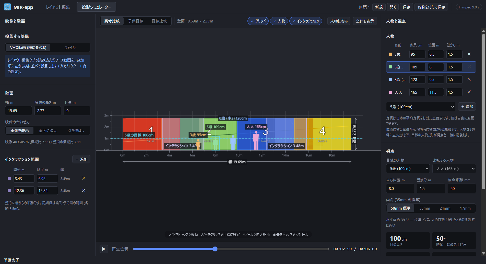
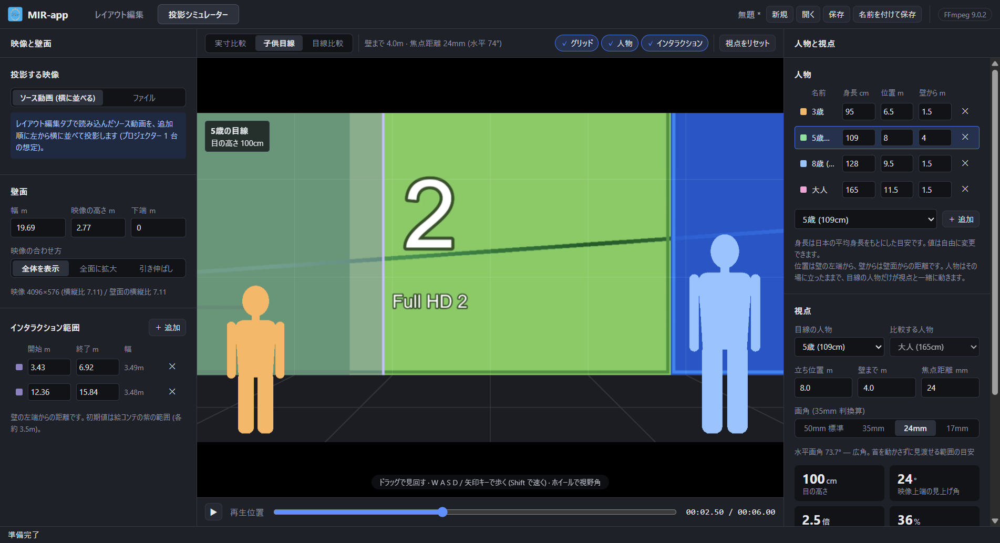
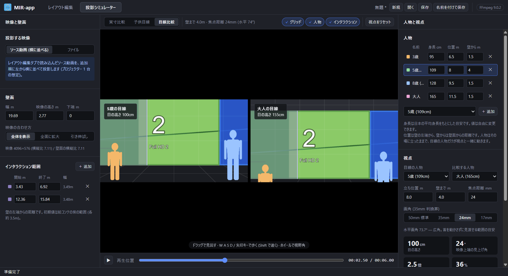

# MIR-app

複数の動画を **切り出して並べ替え、1 本の動画として書き出す** Windows / Mac 用のアプリです。
大きな壁面に映像を投影したときの見え方を、子供の目線で確かめることもできます。

画面上部のタブで機能を切り替えます。

| タブ | できること |
|---|---|
| **レイアウト編集** | 複数の動画を切り出して並べ替え、1 本の動画として書き出す |
| **投影シミュレーター** | 壁面 (既定 19.69m × 2.77m) に映像を投影した想定で、子供の身長と実寸で比べたり、子供目線で見え方を体験したりする |

代表的な使い方は、**Full HD 4 つ分の横長動画 (7680×1080) を、左右に分割して上下 2 段に並べ、4K (3840×2160) で書き出す** ことです
(プリセット「左右分割 → 上下に配置」)。

```
元の動画 7680×1080 (Full HD 4 つ分)
┌────┬────┬────┬────┐
│ 1  │ 2  │ 3  │ 4  │
└────┴────┴────┴────┘
  左半分    右半分

        ▼

書き出し 3840×2160
┌────┬────┐
│ 1  │ 2  │ ← 左半分
├────┼────┤
│ 3  │ 4  │ ← 右半分
└────┴────┘
```



- [インストールと初回起動](#インストールと初回起動)
- [使い方: レイアウト編集](#レイアウト編集)
- [使い方: 投影シミュレーター](#投影シミュレーター)
- [画質について](#画質について)
- [困ったとき](#困ったとき)
- [ライセンス](#ライセンス)

## インストールと初回起動

[Releases](https://github.com/kemushiboy/MIR-app/releases) から使っている環境に合うファイルをダウンロードします。

| 環境 | ファイル |
|---|---|
| Windows (64bit) | `MIR-app-<ver>-win-x64-setup.exe` (インストーラ) または `MIR-app-<ver>-win-x64-portable.exe` (インストール不要) |
| Mac (Apple Silicon: M1 以降) | `MIR-app-<ver>-mac-arm64.dmg` |
| Mac (Intel) | `MIR-app-<ver>-mac-x64.dmg` |

MIR-app はコード署名をしていないため、初回だけ OS の警告が出ます。以下の手順で開いてください。

### Windows

1. ダウンロードした exe を実行すると「Windows によって PC が保護されました」と表示されます。
2. **「詳細情報」** をクリックし、表示された **「実行」** ボタンを押します。

ブラウザ (Edge など) がダウンロード時に「一般的にダウンロードされていません」と警告した場合は、
ダウンロード一覧の「…」→「保存」→「詳細表示」→「保持する」で保存できます。

### macOS

1. dmg を開き、MIR-app を「アプリケーション」フォルダへドラッグします。
2. MIR-app をダブルクリックします。「開いていません」「Apple は検証できませんでした」という警告が出たら **「完了」** を押します。
3. **「システム設定」→「プライバシーとセキュリティ」** を開き、一番下までスクロールします。
   「"MIR-app" は Mac を保護するためにブロックされました」の横の **「このまま開く」** を押します。
4. 確認ダイアログでもう一度 **「このまま開く」** を押し、Mac のパスワード (または Touch ID) で許可します。

2 回目以降は普通にダブルクリックで起動できます。

> macOS 14 (Sonoma) 以前では、Finder で MIR-app を右クリック →「開く」→「開く」でも起動できます。
> macOS 15 (Sequoia) 以降はこの方法が使えないため、上の手順で開いてください。

**「"MIR-app" は壊れているため開けません」と表示される場合** は、ターミナルで次を実行してから開き直してください
（ダウンロードしたファイルに付く「隔離」属性を外すコマンドです）。

```bash
xattr -dr com.apple.quarantine /Applications/MIR-app.app
```

## 使い方

### レイアウト編集

1. **動画を追加する**
   左上の「＋ 追加」を押すか、動画ファイルをウィンドウにドラッグ＆ドロップします。
   複数のカメラで撮った動画の開始タイミングがずれている場合は、各動画の「開始 (秒)」で合わせられます。
2. **並べ方を決める**
   - 左の **プリセット** (「左右分割 → 上下に配置」など) を選ぶと、完成イメージを確認してから適用できます。
   - 「カスタム分割配置…」では、分割する数と並べ方を自由に組み合わせられます。
   - 画面上の各タイルはドラッグで動かせます (ほかのタイルや端に吸い付きます)。矢印キーでも微調整できます。
   - 右パネルで、選んだタイルの「切り出す範囲」と「置く位置」を数値で指定できます。
3. **確認する**
   画面下の ▶ (または Space キー) で、全部の動画を同時に再生しながら確認できます。
   「実出力プレビュー」を押すと、実際に書き出したときと同じ仕上がりの 1 コマを表示します。
4. **書き出す**
   右パネルの「書き出し」タブで画質や保存先を確認し、「書き出し開始」を押します。
   通常は初期設定 (元の動画と同じ形式・視覚的に劣化のない画質) のままで問題ありません。

   

作った並べ方は「保存」でファイルに残せます。同じ並べ方を別の動画で使うときは、
保存したファイルを開いて、各動画の「差替」でファイルを入れ替えてください (タイルの配置はそのまま残ります)。
投影シミュレーターの設定も同じファイルに保存されます。

#### ショートカット

| キー | 動作 |
|---|---|
| Ctrl+S / Ctrl+Shift+S | 保存 / 名前を付けて保存 |
| Ctrl+O / Ctrl+N | 開く / 新規 |
| Ctrl+Z / Ctrl+Y | 元に戻す / やり直し |
| Space | 再生 / 一時停止 |
| Ctrl+D | 選んだタイルを複製 |
| Delete | 選んだタイルを削除 |
| 矢印 (Shift と一緒に押すと大きく) | 選んだタイルを動かす |

Mac では Ctrl の代わりに ⌘ (Command) キーを使います。

### 投影シミュレーター

壁面に映像を投影したときの大きさを、子供の身長と比べて確かめるための機能です。

1. **映像を選ぶ** (左パネル)
   - 「ソース動画 (横に並べる)」: レイアウト編集で追加した動画を、追加した順に左から横に並べて映します
     (プロジェクター 1 台につき動画 1 本の想定)。レイアウト編集と同じように再生できます。
   - 「ファイル」: 好きな動画や画像を 1 つ選んで映します。
2. **壁面を設定する** (左パネル)
   - 幅・映像の高さ・下端の高さ (m) を指定します。初期値は絵コンテから読み取った実寸 (幅 19.69m × 高さ 2.77m、下端は床面) です。
   - **インタラクション範囲** を壁に紫の帯で重ねて表示できます。範囲は追加・変更できます。
3. **人物を並べる** (右パネル)
   2 歳〜大人の平均身長の目安から人物を追加し、身長と立ち位置を自由に変えられます。
4. **表示を切り替える** (画面上のボタン)

| 表示 | 内容 | 操作 |
|---|---|---|
| 実寸比較 | 壁と人物を実寸の比率で並べた図。目線の高さを点線で示す | 人物をドラッグで移動・クリックで「目線の人物」に設定、マウスホイールで拡大縮小 |
| 子供目線 | 選んだ人物の目の高さから見た景色 (3D) | ドラッグで見回す、W A S D / 矢印キーで歩く (Shift で速く)、ホイールでズーム |
| 目線比較 | 2 人の見え方を左右に並べて比べる | 子供目線と同じ |







- 「目線の人物」に選んだ人は、自分として視点と一緒に動きます。ほかの人物はその場に立ったままです。
- 右パネルに、目の高さ・映像の上端を見上げる角度・壁の高さが身長の何倍か などを表示します。
- グリッド・人物・インタラクション範囲の表示は、画面上のボタンで切り替えます (初期状態は非表示)。

**見え方の広さ (画角)** はカメラのレンズにたとえて選びます。

| 設定 | 見える範囲 | 目安 |
|---|---|---|
| 50mm (初期値) | 左右 約 40° | 人の目でじっと見たときの見え方に近い |
| 35mm | 左右 約 54° | 見ている所の周りまで |
| 24mm | 左右 約 74° | 首を動かさずに見渡せる範囲 |
| 17mm | 左右 約 93° | 視界の端まで (端はゆがんで見えます) |

> 身長は日本の平均身長 (乳幼児身体発育調査・学校保健統計) をもとにした目安です。目の高さは体の比率から推定しています。

## 画質について

動画の一部を切り取って並べ替えるには、いったん映像を展開して作り直す (再圧縮する) 必要があります。
MIR-app はそのときの劣化ができるだけ少なくなるよう、次のように書き出します。

- 切り取った映像は拡大・縮小せず、そのままの画素で並べます (同じ大きさで置いた場合)。
- 元の動画と同じ形式 (H.264 なら H.264、ProRes なら ProRes など) と色の設定で書き出します。
- 音声は、元の音声をそのまま使います。

「書き出し」タブの **画質** では次から選べます。

| 画質 | 内容 |
|---|---|
| 視覚的ロスレス (初期値) | 見た目では元の映像と区別できない画質 |
| 高画質 | 画質を保ちつつ、ファイルを小さめにする |
| 数学的ロスレス | 元の映像と完全に同じ。ファイルがとても大きく、再生できる機器が限られる |
| ビットレート指定 | ファイルの大きさ (データ量) を数値で指定する |

**エンコーダ** で「NVIDIA NVENC」「Intel Quick Sync」「AMD AMF」「Apple VideoToolbox」を選ぶと、パソコンの GPU を使って速く書き出せます
(使えるものだけが表示されます)。同じファイルサイズなら、初期設定のソフトウェアの方が画質は上です。

## 困ったとき

| 症状 | 対処 |
|---|---|
| 起動時に警告が出て開けない | [インストールと初回起動](#インストールと初回起動) の手順で開いてください |
| 一部の動画が再生ボタンで動かず、静止画のまま | ProRes や DNxHR など、アプリ内で再生できない形式です。画面の確認用の表示だけの制限で、書き出しは正常に行えます |
| 書き出しに時間がかかる | 4K の書き出しは時間がかかります。「エンコーダ」で GPU (NVENC / Quick Sync / AMF / VideoToolbox) を選ぶと速くなります |
| 保存していない変更がある状態で閉じようとした | 「保存して終了 / 保存せずに終了 / キャンセル」を選ぶ画面が出ます |

## ライセンス

MIR-app は **GNU General Public License v3.0 以降 (GPL-3.0-or-later)** で公開しているフリーソフトウェアです。
全文は [LICENSE](LICENSE) を参照してください。

```
MIR-app
Copyright (C) 2026 ishikawa

This program is free software: you can redistribute it and/or modify
it under the terms of the GNU General Public License as published by
the Free Software Foundation, either version 3 of the License, or
(at your option) any later version.

This program is distributed in the hope that it will be useful,
but WITHOUT ANY WARRANTY; without even the implied warranty of
MERCHANTABILITY or FITNESS FOR A PARTICULAR PURPOSE.  See the
GNU General Public License for more details.
```

アプリには [FFmpeg](https://ffmpeg.org/) (GPL) と [Electron](https://www.electronjs.org/) (MIT) を同梱しています。
取得元とソースコードの入手先は [THIRD-PARTY-NOTICES.md](THIRD-PARTY-NOTICES.md) を参照してください。

---

**開発者の方へ**: ビルド方法・リリース手順・内部の仕組みは [docs/DEVELOPMENT.md](docs/DEVELOPMENT.md)、
画面デザインとタブ追加のルールは [docs/DESIGN.md](docs/DESIGN.md) にまとめています。
